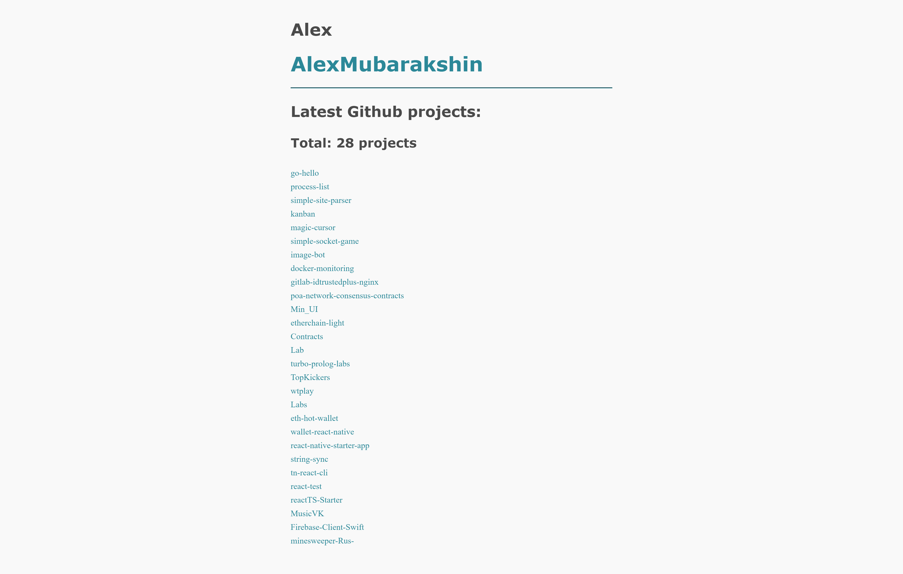

# ghub-profile

Scrap my github profile and display personal github projects.

<p align="center">
  
</p>

## Usage
```
$ go build ./ghub.go

# For scrap your profile, pass in args your github nickname
$ ./ghub.exe YourProfileName

# Open localhost:8080
```
